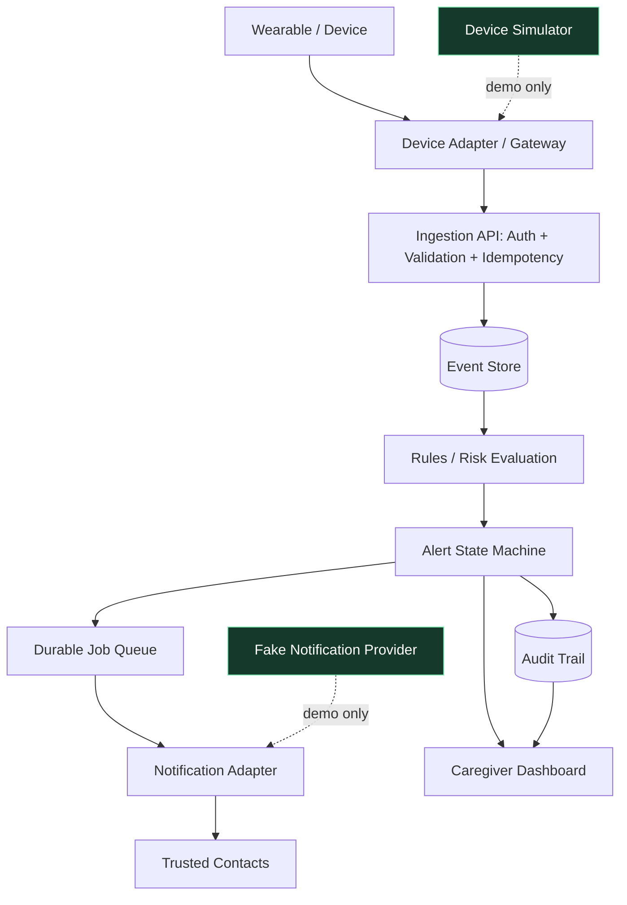

# GuardianX — Architecture Diagram

```mermaid
flowchart TD
    A[Wearable / Device] --> B[Device Adapter / Gateway]
    B --> C[Ingestion API: Auth + Validation + Idempotency]
    C --> D[(Event Store)]
    D --> E[Rules / Risk Evaluation]
    E --> F[Alert State Machine]
    F --> G[(Audit Trail)]
    F --> H[Durable Job Queue]
    H --> I[Notification Adapter]
    I --> J[Trusted Contacts]
    F --> K[Caregiver Dashboard]
    G --> K
    L[Device Simulator] -. demo only .-> B
    M[Fake Notification Provider] -. demo only .-> I
    style L fill:#153a2b,stroke:#7ce6b0,color:#fff
    style M fill:#153a2b,stroke:#7ce6b0,color:#fff
```

Dashed demo adapters are the only permitted integrations in the initial prototype. Real emergency dispatch is not part of the current scope.
